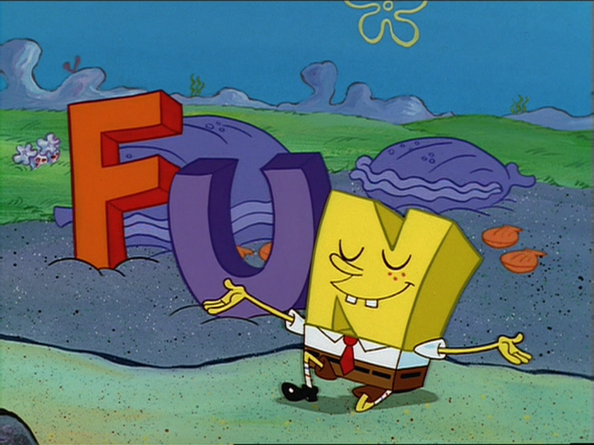

<br>

### 1. Intro

Nowadays maps and other kinds of **geospatial visualizations** are in every nook and cranny. It seems everybody loves **geoviz**, but why?. Probably, there may be a lot of good reasons for it, although the most important is that we can read and comprehend them effortlessly. Even when I have shown to my students some weird maps ([**Cartogram**](https://en.wikipedia.org/wiki/Cartogram)). They have continued to explain with success the essence of the map. It makes me think that **all of us** have a kind of exceptional condition **innate** for a spatial-oriented way of thinking. 


```{r, out.width = "400px", fig.align="center"}

```

### 2. Course Description

This course is a gentle introduction for learning to make maps with high impact. In my opinion a critical skill in the age of data explosion. There are a lot of multiple tools for starting to produce **geoviz**. In this course will use R and RStudio mainly. There are a lot of good reasons for this:

  - The R community.
  - Open-source (free) software.
  - A huge amount of new packages ([**crosstalk**](https://rstudio.github.io/crosstalk/), [**r2d3**](http://www.r2d3.us/), [**furrr**](https://purrr.tidyverse.org/), [**reticulate**](https://github.com/rstudio/reticulate), [**etc.**](https://awesome-r.com/#awesome-r-2018)), all of them count with a cohesive narrative that helps to get in-depth knowledge quickly.
  - R is easy lo learn.
  - R is cross-platform
  - etc.

No prior programming knowledge is required and all

### 3. Objectives

  - Insert **tidyverse** in your daily data science workflow.
  - Learn about the available R spatial objects.
  - Plot static and dynamics geospatial visualizations.
  - Learn about reproducible research.
  
### 4. Contained

  - Choropleth maps in plotly.
  - Creating Cartograms in R.
  - Geospatial animations with plotly.
  - Geospatial animations with gganimate.
  - Web maps with Leaflet.
  - Widget interactions with Crosstalk.
  - Interactive Mapping with Shiny.
  - Tips for 3D Surface Representations.
  - Flexdashboards for Spatial data communication.
       
### 5. Acknowledgment


