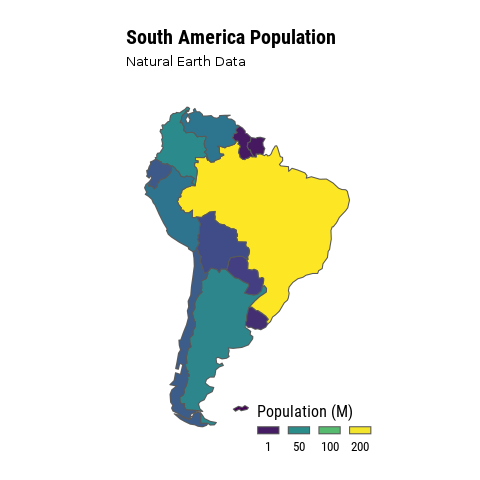

```{r setup, include=FALSE}
knitr::opts_chunk$set(echo = TRUE, eval = FALSE,message = FALSE)
```

<br>

### 1. Intro

Nowadays maps and other kinds of **geospatial visualizations** are in every nook and cranny. It seems everybody loves **geoviz**, but why?. Probably, there may be a lot of good reasons for it, although the most important is that we can read and comprehend them effortlessly. Even when I have shown to my students some weird maps ([**Cartogram**](https://en.wikipedia.org/wiki/Cartogram)). They have continued to explain with success the essence of the map. It makes me think that **all of us** have a kind of exceptional condition **innate** for a spatial-oriented way of thinking. 

```{r pop1}
library(rnaturalearth)
library(hrbrthemes)
library(tidyverse)
library(gganimate)
library(cartogram)
library(sf)

# Get a sf object of worldwide from Natural Earth Data
worldmap <- ne_download(scale = 110,
                        type = "countries",
                        category = "cultural",
                        destdir = tempdir(),
                        load = TRUE,
                        returnclass = "sf")

# Filter by CONTINENT column to get South-America
# geometry

worldmap_pop <- worldmap %>%
  filter(CONTINENT =='South America') %>% 
  select('POP_EST') %>%  # country population 
  'colnames<-'(c('pop','geometry')) %>% 
  mutate(pop = as.numeric(pop)/1000000) %>% 
  as('Spatial') # sf to sp

# Create cartogram of country population.
cart_worldmap_pop <- cartogram_cont(worldmap_pop,'pop')
worldmap_pop$group = 0 # geometries of the simple map
cart_worldmap_pop$group = 1 # geometries of the cartogram.

# Bind both in a single sf object
anim_world <- rbind(worldmap_pop,
               cart_worldmap_pop) %>% 
              st_as_sf()

# Build 100 maps (frames) using cubic spline and 
# compile them in a unique file (*.gif). 
p <- ggplot(st_as_sf(anim_world)) + 
  geom_sf(aes(fill = pop), alpha=1) +
  coord_sf(crs = st_crs(anim_world), datum = NA) + #elimina x and y axis text.
  scale_fill_viridis_c( # Compose a palette using 
    trans='sqrt',
    name="Population (M)",
    breaks=c(1,50,100, 200),
    guide = guide_legend( keyheight = unit(3, units = "mm"),
                          keywidth=unit(8, units = "mm"), 
                          label.position = "bottom", 
                          title.position = 'top',
                          nrow=1)) +
  labs(title = "South America Population",
       subtitle = 'Natural Earth Data',
       x=NULL, 
       y=NULL) +
  theme_modern_rc(plot_title_size = 20,
                  axis = FALSE,
                  base_size = 16) + # my favorite theme!
  theme(legend.position = c(0.8, 0.04), 
        axis.text = element_blank(), 
        panel.grid.minor = element_blank(),
        panel.grid.major = element_blank()) + 
  transition_states(group,2,1) + # gganimate is just magical!
  ease_aes('cubic-in-out')

anim <- animate(p,duration = 4) # Create a gif file
# anim_save('population.gif',anim)  #save your gif
```


```{r, out.width = "500px", fig.align="center",eval = TRUE, echo = FALSE}

```

### 2. Course Description

This course is a gentle introduction for learning to make maps with high impact. In my opinion a critical skill in the age of data explosion. There are a lot of multiple tools for starting to produce **geoviz**. In this course will use R and RStudio mainly. There are a lot of good reasons for this:

  - The R community.
  - Open-source (free) software.
  - A huge amount of new packages ([**crosstalk**](https://rstudio.github.io/crosstalk/), [**r2d3**](http://www.r2d3.us/), [**furrr**](https://purrr.tidyverse.org/), [**reticulate**](https://github.com/rstudio/reticulate), [**etc.**](https://awesome-r.com/#awesome-r-2018)), all of them count with a cohesive narrative that helps to get in-depth knowledge quickly.
  - R is easy lo learn.
  - R is cross-platform
  - etc.

No prior programming knowledge is required and all

### 3. Objectives

  - Insert **tidyverse** in your daily data science workflow.
  - Learn about the available R spatial objects.
  - Plot static and dynamics geospatial visualizations.
  - Learn about reproducible research.
  
### 4. Contained

  - Choropleth maps in plotly.
  - Creating Cartograms in R.
  - Geospatial animations with plotly.
  - Geospatial animations with gganimate.
  - Web maps with Leaflet.
  - Widget interactions with Crosstalk.
  - Interactive Mapping with Shiny.
  - Tips for 3D Surface Representations.
  - Flexdashboards for Spatial data communication.
       
### 5. Acknowledgment


